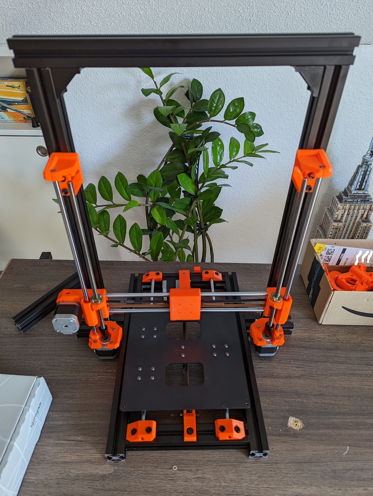

# CustomPrinter X1

## The Idea

My Anycubic Mega S was performing quite well for two years, when I suddenly had several kill calls by the firmware due to thermal runaway. I could not isolate the problem. I changed the thermister, heater cartridge, checked the cables .... no change. Sometimes it printed flawless for weeks, other times it stalled several times a day.

So I decided to strip the Mega S for its parts and try to start from scratch, by building my own 3D Printer. The goals where:
- Upgrade to a 32bit board
- Construct a 3030 aluminium extrusion frame, that are intentinally not cut to exact lengths, so the can be used later on
- Add an all metal V6 style Hotend to be able to experiment beyond PETG
- Add a TFT35 display to be able to use the retro-style marlin display, as well as the TFT35 GUI (and customize the GUI)
- Configure Marlin from scratch, to learn more about the firmware and have it fit my printer
- Initially use parts from prusaprinters/thingiverse and replace them, once that printer works reliable, with parts designed by me
- Publish my firmware/parts/ideas/findings on my github to encourage others to do the same or recreate my build

## Parts used from the Anycubic Mega S

The following lists all the parts I reused from disassembling the Mega S:
- Both Z-Axis Nema 17s
- The shorter Extruder NEMA 17
- Both Nema 17s with fixed toothed wheel
- Both 8mm linear rods
- Both 8mm lead screws + lead screw idlers
- Both idler wheels (x axis and heatbed)
- Heatbed (carrier and heatbed itself)
- 12V PSU
- Radial fan from part cooler

## Parts bought to replace / upgrade
- Bigtreetech TFT35 E3 (initially wanted to use the TFT35 V3, but pirces where to high)
- Bigtreetech SKR 2.0 Rev B
- Bightreetech TMC2208
- V6 All Metal Clone (12V)
- PEI coated build plate
- BMG Extruder
- Capricorn PTFE Tube
- Noctua 120mm / 40mm fan
- 2 x 100mm 3030 extrusions
- 3 x 200mm 3030 extrusions
- 3 x 400mm 3030 extrusions
- 2 x 500mm 3030 extrusions
- Nut 8 inline 3030 extrusion angles/mounts
- 2mm pitch belts
- 16AWG Silicon wire
- 4 Core LED Wire 
- JST Connector Set
- JST-SM Connector Set

## Printed Parts from thingiverse / prusaprinters
- [Z-Motor Mount, Z Top Mount, X Motor Mount, X Idler Mount, Y Rod Mounts](https://www.thingiverse.com/thing:2686588/files)
- [V6 Bowden Mount](https://www.thingiverse.com/thing:2023947)
- [V6 Bowden Mount 40mm Hotend Fan Mod](https://www.thingiverse.com/thing:4131521)
- [X Axis Carriage](https://www.thingiverse.com/thing:2514659)
- [PSU Mount for 3030 Frame](https://www.thingiverse.com/thing:4222489/files)

## Printed parts designed by me
- [SKR 2 Rev B Case for 3030 Frame](https://github.com/JetDev22/CustomPrinterX1/blob/main/STLs/SKRCase.stl)
- [SKR 2 Case Top with 120mm Fan mount](https://github.com/JetDev22/CustomPrinterX1/blob/main/STLs/SKRCaseTop.stl)
- [3030 Y Endstop Mount](https://github.com/JetDev22/CustomPrinterX1/blob/main/STLs/YEndstop.stl)
- [3030 Y Motor Mount](https://github.com/JetDev22/CustomPrinterX1/blob/main/STLs/YMotor.stl)
